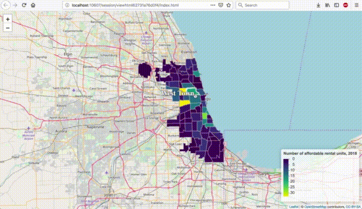

# Professional_Portfolio

A repository showcasing new things I'm learning.

## Adding `ggplot2` graphics inside popups on a `leaflet` map



## Packrat Intialization

I'm using [`packrat`](https://rstudio.github.io/packrat/) to make my scripts as reproducible as possible. Prior to running any of my scripts, run the following lines of code:

```R
install.packages("here")
install.packages("packrat")

# set up the project directory to use `packrat` with packrat::init()
# note: if you're unfamiliar with the `here` package,
#       read this asap: https://github.com/jennybc/here_here#ode-to-the-here-package.
packrat::init(here::here())

# end of script #
```

*Last updated: September 16, 2018*